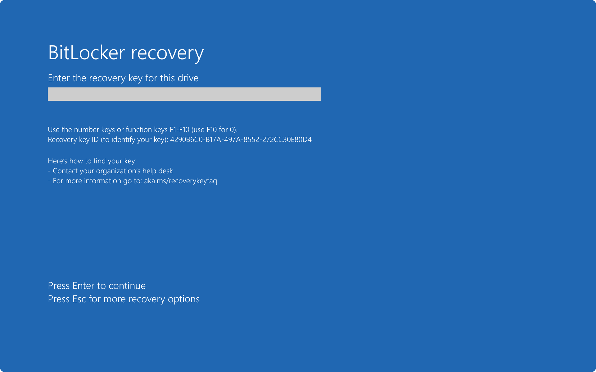
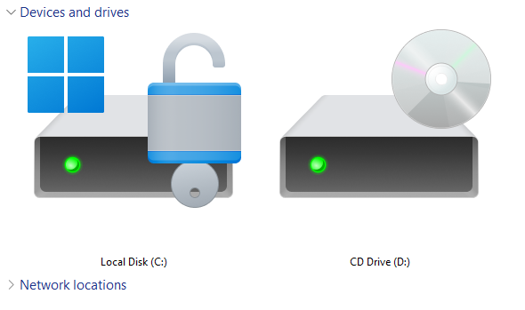
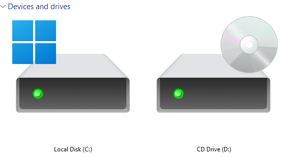

# About Dracut
TITLES:

1. Dracut: how Linux kernel puts on a diet

On Windows installing a driver is as easy as installing an app. Since Linux
kernel is a monolithic kernel, all the code it can run has to be available at
the build time.

But there are so many devices Linux supports and Linux kernel has so many
features so if you build all the kernel code into the image, you'll end up with
a huge image. Linux distros have to distribute the kernel that works on most
machines. The computers nowadays have so many different devices: most PCs now
have NVME SSD, while some PCs still have SATA drives. Laptops have WiFi cards
while PCs have ethernet cards. Technically, the Linux kernel has to be built
with all the code for the devices to be able to use them.

When built with all the features, the size of the image can easily pass 100MB.
Most machines don't even use half of the features of kernel to function, so
basically, most of that 100MB is wasted memory.

To solve the image issue, modern distros build the device drivers in modules so
that only the drivers needed for the machine get loaded onto the memory. So the
kernel image you download off the package manager only contains essential code
that can't be made as a module. The problem with this is that the drivers that
kernel needs to boot could be built as modules.

For example, the EXT4 root file system could be on a NVME drive. After the
kernel image is loaded by the bootloader, in order for the kernel to mount the
file system, it needs the device driver to use the device and the EXT4 file
system module to mount the file system to root. If the file system is encrypted,
the kernel needs the encryption module. If the file system is in LVM, it needs
the module for that, too. To ship the modules necessary in this process, modern
distros use what's called "initrd" or initial ramdisk. The initial ramdisk is an
image of a read-only root file system that contains all the programs and kernel
modules necessary in mounting the real root file system.

The initial ramdisk is an optional feature of the Linux kernel. When making the
kernel image, if you know the type of machine that will run the image, you'd
know which drivers need to be in the image and which ones can be built as
modules. So in that case, initial ramdisks don't make sense a lot of sense. The
images for embedded Linux are built without the initial ramdisk support because:

1. The code for initial ramdisk takes up a significant amount of memory. When
   every kilobyte counts, initial ramdisk is the first one to go
1. It's slow: in addition to the kernel image, the bootloader has to decompress
   and load the image onto the memory. The kernel has to load the modules off
   the image and then unload the image once it's finished with it

So you wouldn't see much of initial ramdisk on embedded devices.

The initial ramdisk image can be made in two different ways: it can contain all
the kernel module the kernel is built with, the modern distros call this type
"rescue image", the other type, called "hostonly" mode, only contains modules
needed for your machine. Most distros generate the hostonly mode by default to
reduce the size of the image.


The problem with initial ramdisks is that if you take the hard drive off the
machine and put it in another machine, it might not be able to boot because
different kernel modules might be required. This is especially the case when you
upgrade your PC and want to use the existing copy of Linux without reinstalling.
To solve this, you can drop to the bootloader menu by pressing the escape key.
If you get dropped to the shell instead of the menu, you can run `normal`
command to bring up the menu. Then you can use the rescue image to boot up the
system to update the image[^2].


Ubuntu provides the convenience command `update-initramfs`. This one command
will update the image for the newest kernel[^1].

```sh
update-initramfs -u
```

RHEL based distros provide `dracut` command. First, you need to discover the
versions of the kernel installed in the file system by looking at the files in
`/boot`. The structure, depending on the distro, will be either in the
traditional flat model or the new BLS model. In this image here, the latest
version is 4.18.0-553.8.1.el8_10.x86_64. So, to regenerate the image for that
particular version, you can run the command like so.

```sh
dracut -f --kver 4.18.0-553.8.1.el8_10.x86_64
```

## No-hostonly initrd
TITLES:

1. Linux on this USB can boot on any machine
1. Linux on USB: using Linux without formatting your Windows

In the previous video, I talked about why `dracut` exists and how distros use
dracut to reduce the size of initial ramdisk images. (TODO: QUEUE the
annotation)

You might be new to Linux and just want to try things out without messing around
with your Windows partitions on your machine. And you may want to try Linux on a
real hardware, not in a VM. You can always use a live version of Linux that most
distros offer, but personally, I don't think that gives you a full experience.

In this video, I'll demonstrate how you can use `dracut` to make initial ramdisk
images that are capable of booting on any machine. This was not possible in the
past because the firmware was not good enough to switch between operating
systems. Now, with the EFI, the Linux bootloader is just an EFI program in a FAT
partition. It makes it easier for the firmware to scan for the installed
operating systems on your machine.


To have quality experience, I recommend using a performance USB drive with high
write speed. I'm using Samsung's BAR Plus USB Flash Drive, which has a write
speed of 30MB/s. The write speed of USB flash drives is still a taboo topic in
the industry, so you'll have a hard time finding the write speed in the product
information brochure. My rule of thumb is: if it's USB 3.1 or higher, made by a
renowned manufacturer and it's a little bit pricey, the chances of it having a
decent write speed is higher. I suggest doing a little bit of research before
buying one. Usually, you can find product reviews and benchmarks people have
posted online.



If you have a custom built PC, you probably don't have to worry about Bitlocker
because you probably didn't opt-in for Bitlocker. You can check this on This PC.
A little lock icon on your Windows drive means Bitlocker is active.




If you plan to do this on your laptop: your Windows probably encrypted with
Bitlocker. If it is, it's not a good idea to change the BIOS settings to change
the boot order because Bitlocker will lock up if the BIOS settings have been
changed. Don't blame me, blame Microsoft for having shitty product design.

You can still boot to USB without changing the boot order if you use the BIOS
boot menu. All the venders have different keys, though: depending on your
machine, it could be F9, 10, 11, 12, escape or even delete key. You have to
figure that out yourself.

Now, let's fire up the VM. In this video, I'll use VirtualBox. You can also use
VMware Player. It doesn't really matter which one you use as long as: (TODO:
show settings)

- You can launch your VM with EFI as system firmware
- You can redirect the USB to the VM

For VirtualBox, make sure you install the extension as well so that the VM has
full USB 3.0 capabilities.

(TODO: play through: installing Ubuntu on a USB using VirtualBox, not attaching
a HDD)

Now that we've installed Linux on the USB drive, I'll now show how you can the
rebuild initial ramdisks so that the USB works on any x86 machine.

You don't really have to do this. You can always update your initial ramdisk
images after booting up the rescue image. Because of the size, having the full
initial ramdisk can slow the boot up process by a little bit. But having a full
initial ramdisk is great when you have to switch between the different PCs, so
if that's the case, you should definitely go through this process as well.

(TODO: show how to drop to GRUB and boot using the rescue image)

Now, let's have a look at the manuals.

```sh
man 8 dracut
```


Capital H option turns on the hostonly mode. Capital N option disables it. But
how does the distro override this setting?

```sh
man 5 dracut.conf
```


So the dracut command reads settings from these files. And it says here that the
mode can be set with the `hostonly` setting.


Now let's see what files are in those directories.

```sh
ls -l /etc/dracut.conf /etc/dracut.conf.d/*.conf /usr/lib/dracut/dracut.conf.d/*.conf
```


Okay, does any of these files set the `hostonly` setting?

```sh
grep hostonly /etc/dracut.conf /etc/dracut.conf.d/*.conf /usr/lib/dracut/dracut.conf.d/*.conf
```


There it is. Now, we want to override that setting. Notice that the hostonly
setting is from the file named `01-dist.conf`. This means that we can prefix our
file name bigger than 01 to override settings from that file. We're gonna place
it in `/etc/dracut.conf.d` so other people will know in the future that it's
sysadmin's custom config, not the distro's.

```sh
echo 'hostonly="no"' | sudo tee /etc/dracut.conf.d/90-no-hostonly.conf
```

Now, I'm making sure that the command worked.


we see the file we just made. Now we can run dracut to test if it applies.

(DEMO: ls -h first to keep the size of the old initrd, regen the initrds, do ls
-h again to compare the size)

You can see that it worked by comparing the sizes of the old and the new image.
We can tell it is applied because the new image is bigger. You might think that
that amount of space is wasted, but that's not the case because the image is
only used to mount the root file system. So soon after mounting the root file
system, the kernel unloads it to reclaim the memory. This config will apply to
the future versions of kernel installed by the package manager when you update
the system.

We can now test the image on a real machine.

(DEMO: boot to the USB using the boot menu)

There you go. You now have a Linux on a USB. If you're not happy with Linux and
want to go back to using Windows, you can just unplug the thing. You didn't do
anything to your Windows partitions so everything should work just fine as you
left them.

[^1]: https://manpages.ubuntu.com/manpages/focal/en/man8/update-initramfs.8.html
[^2]: https://wiki.ubuntu.com/RecoveryMode
